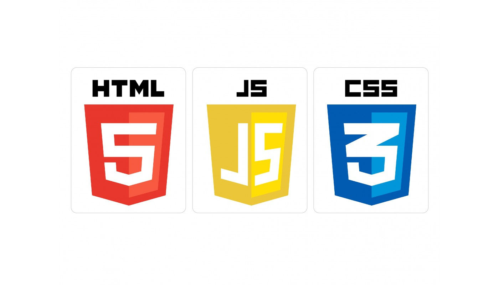
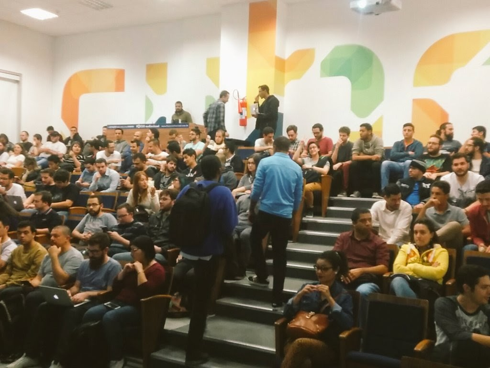
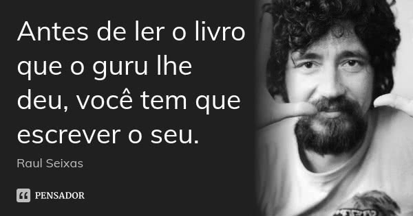

Esse é um texto absolutamente pessoal e recheado de clichês.

Tudo que vou citar diz respeito tão somente a minha realidade. As pessoas possuem oportunidades e ritmos diferentes, portanto não se sinta mal caso algumas dessas coisas não faça parte da sua realidade, não consiga colocar em prática, ou mesmo não concorde com algo.

Algumas dessas coisas eu fiz no passado ou faço atualmente, outras não coloquei em prática e penso que poderiam ter trazido resultados importantes na minha carreira.

## 1. Aprenderia inglês

Máximo dos clichês, presente em 100% das dicas dadas por especialistas e também “especialistas”, de todas as profissões. Porém é impossível não concordar da importância e do impacto que isso traz em qualquer profissão.

O inglês acabou se tornando um denominador comum entre os diversos idiomas, e de verdade, se eu pudesse voltar no tempo, mesmo antes de iniciar minha carreira, esse seria meu foco.

Claro que é possível ter uma carreira sólida sem dominar esse idioma, mas as vantagens são várias: Livros, artigos, podcasts, discussões, oportunidades no exterior…

Antes de aprender qualquer linguagem de programação, eu teria focado no inglês e mesmo após iniciar no mercado, continuaria os estudos em paralelo.

## 2. Aprenderia lógica de programação

](logica.png)*[https://www.123rf.com/photo_16084282_abstract-word-cloud-for-logic-programming-with-related-tags-and-terms.html](https://www.123rf.com/photo_16084282_abstract-word-cloud-for-logic-programming-with-related-tags-and-terms.html)*

Como não tive background como programador no inicio da carreira, sinto falta de uma base mais sólida em lógica de programação, tenho certeza que meus códigos seriam muito melhores atualmente.

Então é outro ponto, que junto com inglês, considero fundamental para qualquer desenvolvedor e gostaria de ter descoberto isso mais cedo.

## 3. Buscaria seguir as referências da profissão

Seguiria as pessoas que mais trazem impacto na comunidade e são tidas como referências profissionais ou técnicas.

Tentaria então entender porque são tidas como referências. O que fizeram? O que criaram? Que tipo de postura profissional elas tem? O que comem? Onde vivem?

E me inspiraria para construir a minha própria história.

## 4. Focaria nas linguagens básicas

Sempre trabalhei com desenvolvimento web, então, essas linguagens são HTML, CSS e JavaScript, simples assim.

Dentro dessas linguagens temos milhões de libs, frameworks, preprocessadores… alguns exemplos

- **HTML**: Jade, Pug, Nunjucks, Handlebars…
- **CSS**: Stylus, Sass, Less, PostCSS, CSS Modules…
- **JavaScript:** React, Angular, Vue, Ember, TypeScript…

Por debaixo dos panos, estamos usando as mesmas linguagens faz muitos anos, e provavelmente vamos continuar usando por bastante tempo.

Sendo assim, antes de me aprofundar em qualquer lib, estudaria a fundo esse tripé básico.

## 5. Aprenderia uma coisa por vez

Sendo muito prático: Aprenderia HTML, CSS e JavaScript básico (nível interface) e depois JavaScript avançado.

Primeiro, porque HTML e CSS se complementam naturalmente, e especialmente CSS é complexo PRA CARALEO (desenvolva um CSS de merda e tente dar suporte daqui 1 ano) e já vai dar conteúdo suficiente para bastante tempo de estudo.

Segundo, porque é possível desenvolver projetos usando [APENAS HTML e CSS, sem usar uma fucking linha de JavaScript](https://www.felipefialho.com/css-components/).

Terceiro, porque as lógicas de CSS e JavaScript são completamente diferentes, e isso é muito confuso para um iniciante. Muita informação, de linguagens tão diferentes, pode ser frustrante para quem está começando.

E assim que estivesse totalmente confortável, eu cairia de cabeça em JavaScript, essa linguagem é poderosa, incrível e mudou (e continua mudando) o mundo de desenvolvimento.

## 6. Contribuiria em projetos open-source de terceiros

Se atentem que além do já clichê: “faça open-source”, adicionei “de terceiros”. E isso tem explicação.

Primeiro, que existem milhares e milhares de projetos, de todos os tipos. Então, praticamente qualquer ideia que você tenha, já deve existir uma lib criada e esperando contribuições.

Segundo que ao participar de projetos open-source de terceiros, você é obrigado a fazer commits e pull-requests decentes, entender e ter humildade para usar o padrão código usado.

## 7. Entenderia tudo que abrange meu ecossistema

Desenvolvimento vai muito além de código, então para ser um profissional cada vez mais relevante, buscaria aprender e entender desde cedo tudo que engloba minha profissão.

Metodologias, UX, Design, SEO, Acessibilidade, o próprio mercado e funcionamento do dinheiro… e mais várias e várias coisas que impactam diretamente no desenvolvimento.

Cada uma delas, iria me ajudar a ter uma visão mais ampla e entender além da tela do IDE.

## 8. Iria em eventos

*MeetupCSS no Cubo*

Já escrevi algumas vezes da [importância de eventos para developers](https://codetalks.net/por-qual-motivo-todo-desenvolvedor-deve-ir-em-eventos-d1f276cf16b), portanto não vou me estender nesse assunto.

Diria que eventos menores como Meetups, são ainda mais interessantes para quem está começando, normalmente são gratuitos e existe uma proximidade maior entre as pessoas.

Se não tivesse nenhum evento na cidade onde moro ou do assunto que estivesse estudando, criaria meu próprio evento. Duas pessoas já são suficientes para que um Meetup aconteça 😉

Infelizmente descobri tarde o quão impactante os eventos podem ser na carreira e com certeza teria começado a ir assim que comecei como desenvolvedor.

## 9. Escutaria os profissionais mais experientes

Pessoas com muitos anos de profissão, com certeza passaram por muitas situações que poderiam me ser úteis.

Não exitaria em aprender e absorver o máximo possível de profissionais mais vividos, desde padrões e dicas de códigos, até decisões e opções profissionais.

## 10. Teria minha própria opinião

*[https://www.pensador.com/frase/MTYzNzA/](https://www.pensador.com/frase/MTYzNzA/)*

Fazendo contra ponto do número oito.

É super importante aprender com os erros e acertos de outras pessoas, isso ajuda a crescer profissionalmente, mas esses erros e acertos continuam sendo… de outras pessoas.

Escutaria e absorveria tudo que profissionais mais experientes me dissessem, mas jamais tomaria aquilo como verdade absoluta e formaria sempre minhas próprias opiniões.

## 11. Evitaria fazer freelas

[Bernard De Luna](undefined) e [Zeno Rocha](undefined) [falaram sobre isso](https://www.youtube.com/watch?v=y8UUKv7j0l0) em 2012 e continuo totalmente de acordo.

Que fique claro, como disse no começo do texto, as pessoas vivem em realidades diferentes, então isso pode fazer sentido pra mim, mas talvez não faça pra você, nenhum problema nisso.

Então, a não ser que eu precisasse MUITO de uma renda extra no fim do mês, evitaria fazer freelas e focaria totalmente nos meus estudos, em ir aos eventos e em projetos open-source.

Na maior parte das vezes você vai receber muito menos do que deveria receber e vai trabalhar muito mais do que deveria trabalhar.

## 12. Tomaria cuidado com a síndrome do impostor

Um [problema grave](https://medium.com/@bernarddeluna/ol%C3%A1-devs-precisamos-falar-sobre-estresse-e-ansiedade-bde1b04f897e), que atinge um número enorme de developers, e pode gerar [muita desmotivação](https://medium.com/@lfeh/a-motiva%C3%A7%C3%A3o-desmotivacional-no-mundo-do-desenvolvimento-d0a9fcd47fd1).

Somos bombardeados por um número enorme de informações todos os dias, novas libs, novos frameworks, novas metodologias… e é quase impossível absorver todo esse conhecimento.

Já fui atingido por esse problema várias vezes, especialmente nos períodos mais intensos de estudo, o que é uma contradição, quanto mais você estuda e aprende, mais descobre que está longe de chegar em um estado que se considere bom profissional.

É muito difícil lidar com isso, mas o que faria para me previnir desse mal é: traçar metas pessoais, não me comparar com outros profissionais e aprender uma coisa por vez.

## 13. Estipularia metas

Para alcançar os resultados de forma mais eficaz e conseguir entender o quão distante estou dos meus objetivos, estipularia algumas metas.

E seria interessante que esses estudos estivessem atrelados em prazos. Portanto, além de ter um guia das coisas que gostaria de aprender, definiria também um prazo de “entrega” para cada uma dessas metas.

Tenho um artigo chamado “[Aproximando seus estudos de cenários reais](https://www.felipefialho.com/blog/2015/aproximando-seus-estudos-de-cenarios-reais)” em que falo justamente sobre isso, e com certeza teria me ajudado se tivesse descoberto antes sobre a importância de lidar com prazos.

## 14. Não deixaria de ter hobbies ou praticar atividades físicas

*Sagrado futebol de domingo*

É natural quando você está focado nos estudos e na profissão, que atividades que você adorava realizar e te deixavam feliz, fiquem para segundo plano.

Mas isso não deveria acontecer. Deixaria sempre espaços na minha agenda para fazer todas as atividades que mais gosto e me fazem bem, e não abriria mão disso. Faz bem pro corpo e pra mente.

Isso significa que raramente estudaria ou trabalharia no fim de semana.

## 15. Compartilharia meus conhecimentos

Jamais deixaria os resultados dos estudos, os aprendizados dos projetos ou os conhecimentos adquiridos, presos no meu cérebro. Isso é inconcebível.

Sendo assim, desde o inicio buscaria formas de compartilhar tudo que estivesse aprendendo, seja escrevendo artigos, gravando podcasts ou através de vídeos.

Conhecimento deve ser trocado entre todas as pessoas, sempre.

E vocês? Se tivesse a oportunidade de voltar no tempo ou estivesse iniciando suas carreiras, o que fariam?

É nóis 🤘

## Me acompanhe por aí…

**Twitter: [**@felipefialho_ ](https://twitter.com/felipefialho_)**
Github: [**@felipefialho](https://github.com/felipefialho)**
Site: [**felipefialho.com](https://www.felipefialho.com/)
